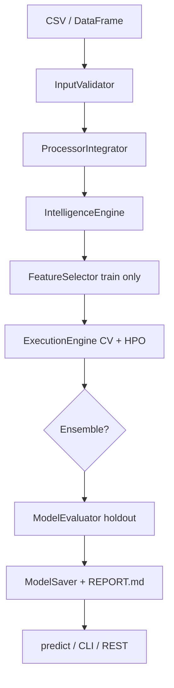

# AutoForge — Classical Tabular AutoML

> Train, optimize, evaluate, ensemble, and deploy machine learning pipelines automatically — with a clean sklearn-style API.


**Canonical imports:**

```python
from autoforge import AutoForgeRegressor, AutoForgeClassifier
```

---

## What is AutoForge?

**AutoForge** is an open-source **classical tabular AutoML framework**. You give it a CSV or pandas DataFrame with a target column; it figures out how to preprocess the data, which models to try, how to tune them, and which one to keep — then saves everything you need to predict on new rows or explain the decision later.

Think of it as **sklearn with automation**: instead of writing separate pipelines for imputation, scaling, encoding, model selection, and hyperparameter tuning, you call `fit()` once and AutoForge runs that workflow for you.

### Who is it for?

- **Data scientists & analysts** who want strong baselines quickly on tabular data
- **Engineers** who need a saved pipeline + report they can hand to stakeholders
- **Students & researchers** learning AutoML without wiring every sklearn step by hand
- **Teams** that want reproducible training artifacts (`REPORT.md`, leaderboard, JSON decisions)

### What problem does it solve?

Building a good ML pipeline by hand usually means:

1. Cleaning and encoding columns differently for linear vs tree models
2. Trying several algorithms and tuning each one
3. Checking that validation is honest (no data leakage)
4. Documenting *why* you picked the final model

AutoForge automates all of that on the **classical tabular** path. Advanced paths (deep learning, NAS, multimodal) are **opt-in and experimental** — the default golden path is Random Forest–class ML on spreadsheet-style data.

### AutoForge vs manual sklearn

| You do manually | AutoForge does automatically |
|-----------------|------------------------------|
| Pick imputer + scaler + encoder | Searches among 8 preprocessing **recipes** |
| Try one model at a time | Runs a **model search** across the classical canon |
| GridSearch / Optuna per model | **HPO per algorithm** (Optuna when `balanced`/`deep`) |
| Hope your CV setup is leak-free | **Holdout split first**; feature selection on train only |
| Explain choice in a slide deck | Writes **`REPORT.md`** with leaderboard + rationale |

---

## How training works (step by step)

When you call `fit()`, AutoForge runs roughly this pipeline:

1. **Validate** — checks columns, types, missing values, and detects classification vs regression
2. **Split holdout** — reserves 20% of rows for final evaluation (never used for selection)
3. **Profile & preprocess** — analyzes the train split and picks a preprocessing recipe (`balanced`/`deep`)
4. **Select features** — on train data only, reduces noise columns if helpful
5. **Search models** — cross-validates several algorithms and tunes hyperparameters
6. **Try ensemble** — if top models score similarly, tests a voting ensemble
7. **Evaluate on holdout** — reports honest out-of-sample metrics
8. **Save artifacts** — pipeline + `REPORT.md` when you use `--save-model`

You stay in control via **`search_depth`** (`fast` / `balanced` / `deep`) — trade training time for search thoroughness.

---

## First run in 2 minutes

```bash
git clone https://github.com/AjayRajan05/AutoForge---AutoML-Engine.git
cd AutoForge---AutoML-Engine

python -m venv .venv
# Windows:  .venv\Scripts\activate
# macOS/Linux:  source .venv/bin/activate

pip install -e ".[dev]"

# Built-in smoke test (no CSV required)
python main.py test --type small
```

The smoke test trains on a tiny built-in dataset so you can confirm the install works before using your own files.

Train on your CSV, save artifacts, and predict:

```bash
python main.py train --data data.csv --target price --save-model my_model --report
# Artifacts: models/my_model/REPORT.md, leaderboard.csv, selection_decision.json

python main.py predict --model my_model --data test.csv --output predictions.csv
python main.py info --model my_model
```

| Step | What happens |
|------|----------------|
| `train` | Loads `data.csv`, runs the full AutoML pipeline, prints best score and strategy |
| `--save-model my_model` | Writes the trained pipeline to `models/my_model/` |
| `--report` | Prints a short selection summary and points to `REPORT.md` |
| `predict` | Loads the saved model and adds a `predictions` column to `test.csv` |
| `info` | Shows model type, save time, and file size |

After `pip install -e .`, the `autoforge` console script is equivalent to `python main.py`.

---

## Installation

```bash
pip install -e .
```

**Optional extras:**

```bash
pip install -e ".[lightgbm]"   # LightGBM models
pip install -e ".[dl]"         # TensorFlow + Keras Tuner
pip install -e ".[serve]"      # FastAPI REST server
pip install -e ".[dev]"        # pytest, psutil
pip install -e ".[all]"        # everything above
```

Pinned versions for CI are in `requirements-lock.txt`.

---

## Python API

Choose the API that fits your style:

- **`AutoForgeRegressor` / `AutoForgeClassifier`** — simplest; feels like sklearn (`fit`, `predict`, `score`)
- **`UnifiedAutoML`** — full control; same engine the CLI uses; best for custom config and saving

### Regression (DataFrame + target column)

Best when your data is one table and the target is a column name (typical CSV workflow):

```python
import pandas as pd
from autoforge import AutoForgeRegressor

df = pd.read_csv("data.csv")
test_df = pd.read_csv("test.csv")

model = AutoForgeRegressor()  # search_depth='balanced' by default
model.fit(df, target="price")
model.print_model_comparison()   # see all models tried
preds = model.predict(test_df)
```

### Classification (sklearn-style split)

Best when you already have separate `X_train`, `y_train` arrays or DataFrames:

```python
import pandas as pd
from sklearn.datasets import load_iris
from sklearn.model_selection import train_test_split
from autoforge import AutoForgeClassifier

X, y = load_iris(return_X_y=True)
X = pd.DataFrame(X, columns=[f"f{i}" for i in range(X.shape[1])])
y = pd.Series(y, name="target")
X_train, X_test, y_train, y_test = train_test_split(X, y, test_size=0.2, random_state=42)

model = AutoForgeClassifier(search_depth="balanced", model_family="ml")
model.fit(X_train, y_train)
print(model.score(X_test, y_test))
```

### Full orchestrator

Use this when you need the same object for training, saving, loading, and serving:

```python
from core.unified_automl import UnifiedAutoML
from input_output.input_types import AutoMLInput

automl = UnifiedAutoML({"model_family": "ml", "random_state": 42})
automl.fit(AutoMLInput(data=df, target_column="price"))
automl.save_model("my_model")
preds = automl.predict(test_df)
```

---

## CLI reference

Prefer the terminal? The CLI wraps the same `UnifiedAutoML` engine as the Python API.

| Command | Example |
|---------|---------|
| Train | `python main.py train --data data.csv --target price --save-model my_model --report` |
| Predict | `python main.py predict --model my_model --data test.csv --output predictions.csv` |
| Smoke test | `python main.py test --type small` |
| Model info | `python main.py info --model my_model` |
| List models | `python main.py info` |

**Useful train flags:** `--search-depth fast\|balanced\|deep`, `--model-family ml`, `--preference auto`, `--output results.txt`

Saved models and reports go to **`models/<name>/`** (gitignored except `.gitkeep`).

---

## Search modes

Pick how much time AutoForge spends searching. All modes use the same leakage-aware holdout evaluation at the end.

| Mode | Behavior | When to use |
|------|----------|-------------|
| `fast` | CV on default hyperparameters; no preprocessing recipe search | Quick baseline, CI, or very large tables |
| `balanced` (default) | Preprocessing recipe search + per-model HPO; voting ensemble when top models are close | **Most real workloads** — best time/quality tradeoff |
| `deep` | Preprocessing recipe search + exhaustive grid per algorithm (slowest) | When you need maximum accuracy and can wait |

**Preprocessing recipes** (`balanced` / `deep`): `standard`, `robust`, `minimal`, `poly`, `onehot_low_card`, `quantile`, `no_scale_tree`, `target_encode`.

AutoForge screens these recipes on the **train split only**, then runs model search on the winner.

---

## Key features

- **Dataset validation** — catches bad columns, types, and empty targets early
- **Preprocessing recipe search** — picks among 8 pipelines instead of one fixed preprocessor
- **Feature selection on train only** — holdout rows never influence which features are kept
- **Multi-model search with Optuna HPO** — tries classical algorithms with tuned hyperparameters
- **Adaptive voting ensemble** — combines top models when their CV scores are within `ensemble_epsilon`
- **Holdout evaluation** — 20% split held back until final metrics (reduces overfitting to CV)
- **Training report bundle** — human-readable and machine-readable artifacts for audits and demos

---

## Supported models (classical canon)

AutoForge searches across a fixed set of well-understood tabular models (not black-box only):

**Classification:** Logistic Regression, Random Forest, Extra Trees, XGBoost, Gradient Boosting, SVM, KNN, Naive Bayes

**Regression:** Ridge, Lasso, ElasticNet, Random Forest, Extra Trees, XGBoost, Gradient Boosting, SVR

Install `pip install -e ".[lightgbm]"` to add LightGBM to the registry when needed.

---

## Architecture

High-level view of how modules connect:



- **`core/`** — orchestrates the full workflow (`UnifiedAutoML`)
- **`execution/`** — model search, CV, preprocessing pipelines
- **`persistence/`** — save/load so predict works after restart
- **`serving/`** — optional HTTP API on top of a saved model

---

## Configuration (common keys)

Pass to `UnifiedAutoML(config=...)` or set on estimator kwargs.

| Key | Default | Description |
|-----|---------|-------------|
| `search_depth` | `"balanced"` | `"fast"`, `"balanced"`, or `"deep"` |
| `model_family` | `"ml"` | `"ml"`, `"dl"`, or `"both"` |
| `random_state` | `42` | Reproducibility seed |
| `enable_ensemble` | `True` | Try voting ensemble when top models are close |
| `use_processors` | `True` | Run data-type processors before training |
| `auto_save_model` | `False` | Save automatically at end of `fit()` |

See `CHANGELOG.md` and `docs/SEMVER.md` for version policy.

---

## Outputs after training

When you use `--save-model my_model`, inspect **`models/my_model/`**. These files are what you show stakeholders to prove *how* the model was chosen — not just *what* it predicts.

| File | Contents |
|------|----------|
| `REPORT.md` | Dataset profile, preprocessing choice, model leaderboard (CV + train time + holdout), selection rationale |
| `leaderboard.csv` | Sortable comparison of all models tried |
| `selection_decision.json` | Winner, runner-up, ensemble decision (machine-readable) |
| `preprocessing_report.json` | Selected recipe and pipeline details |

**Demo tip:** open `REPORT.md` after training — it answers “why this model?” better than the terminal summary alone.

---

## REST API (optional)

Deploy a saved model as an HTTP service (requires the `[serve]` extra):

```bash
pip install -e ".[serve]"

# Serve a saved model
python -m serving.run --model my_model --host 0.0.0.0 --port 8000

# Or Docker (mount ./models, set AUTOFORGE_MODEL_PATH)
docker compose up
```

Server: `http://localhost:8000` — see `/docs` for OpenAPI. Useful when another app needs predictions over HTTP instead of importing Python.

---

## Examples

Ready-made scripts in `examples/`:

```bash
python examples/train_and_report.py --data data.csv --target price --save-model my_model
python examples/load_and_predict.py
python -m benchmarking.classical_suite   # writes benchmarks/results/BENCHMARKS.md
```

---

## Testing

```bash
pip install -e ".[dev]"
pytest tests/ -q -m "not slow"    # fast CI suite (~73 tests)
pytest tests/ -q                  # full suite including slow tests
```

Coverage includes preprocessing recipes, save/load round-trips, leakage guards, serving E2E, unseen categories, and integration tests.

---

## Benchmarking

AutoForge ships a classical benchmark suite so you can compare **fast vs balanced** modes and a sklearn baseline on standard datasets.

Datasets: **iris**, **wine**, **california_housing**, **regression_synthetic**, **imbalanced_classification**, **high_cardinality_cats**, **housing_csv**.

Latest results (see [`benchmarks/results/BENCHMARKS.md`](benchmarks/results/BENCHMARKS.md)):

- Balanced beats fast on holdout: **7/7**
- Balanced within 5% of sklearn baseline: **6/7**
- Predict round-trip (save → load → predict): **OK**

Re-run: `python -m benchmarking.classical_suite`

---

## Stable vs experimental

| Area | Status |
|------|--------|
| Tabular ML (`UnifiedAutoML`, `AutoForgeRegressor`/`Classifier`) | **Stable** — primary path |
| Ensembling, Optuna HPO, model persistence, training reports | **Stable** when deps installed |
| Text / time-series processors | **Beta** |
| Deep learning, NAS, multimodal, meta-learning | **Experimental** — opt-in |
| REST serving | **Beta** — no auth; requires `[serve]` |
| Legacy `api/` wrappers | **Deprecated** — use `autoforge` or `core.estimator` |

---

## Known limitations (v1.0)

- Classical tabular focus; DL/NAS/multimodal are not production-grade
- Target encoding uses train-split mean encoding (not full nested CV encoding)
- Intelligence engine may analyze the full dataset before the holdout split (documented tradeoff)
- No ONNX export; serving has no authentication
- Some edge-case datasets (e.g. malformed CSV columns) may need manual cleaning

---

## Project layout

```
core/              UnifiedAutoML, estimators, training reports
execution/         Model search, CV, preprocessing pipeline
processors/        Tabular, text, time-series preprocessing
intelligence/      Dataset analysis and strategy
ensemble/          Voting/stacking integration
optimizer/         Hyperparameter search (Optuna)
persistence/       Save/load pipelines
registry/          Model and feature registries
benchmarking/      Classical benchmark suite
serving/           Optional FastAPI server
tests/             Pytest suite
examples/          Train, predict, benchmark scripts
main.py            CLI entry point
pyproject.toml     Package metadata and extras
```

---

## Contributing

```bash
git checkout -b feature/my-feature
pytest tests/ -q -m "not slow"
```

Open a PR with a clear description, tests, and documentation updates.

---

## License

MIT — see [LICENSE](LICENSE).
